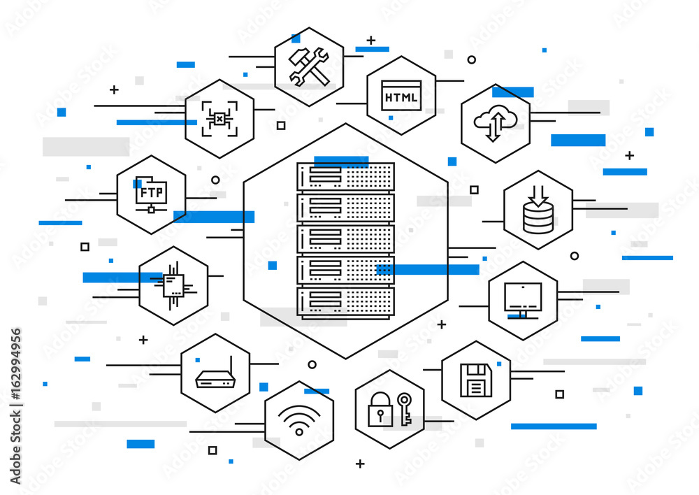

# Web Infrastructure Design

## Overview

This repository contains documentation and design principles for the web infrastructure setup. The purpose of this documentation is to outline the architecture, components, and best practices for building a scalable, secure, and reliable web infrastructure.

## Table of Contents

1. [Introduction](#introduction)
2. [Architecture](#architecture)
3. [Components](#components)
4. [Deployment](#deployment)
5. [Security](#security)
6. [Monitoring and Scaling](#monitoring-and-scaling)

---

## Introduction

Creating a robust web infrastructure is crucial for ensuring optimal performance, reliability, and security of web applications. This README provides guidelines and considerations for designing such an infrastructure.

## Architecture

### High-Level Overview

The architecture is designed with scalability, availability, and performance in mind. It follows a multi-tiered approach, separating components for better management and scalability.

1. **Web Tier**: Handles incoming HTTP/HTTPS requests. Includes load balancers for distributing traffic across multiple servers.

2. **Application Tier**: Houses the application servers responsible for processing requests. These servers communicate with the database and other services.

3. **Database Tier**: Stores and manages data critical for the application. Utilizes a relational or NoSQL database system based on specific requirements.

### Cloud Infrastructure

The infrastructure is deployed on a cloud provider (e.g., AWS, Azure, GCP) leveraging their services for scalability, reliability, and flexibility. Utilizing Infrastructure as Code (IaC) tools like Terraform or CloudFormation ensures consistent provisioning and management.

## Components

### Key Components

1. **Web Server**: Nginx, Apache, or similar, serving static content and handling reverse proxy duties.

2. **Application Server**: Node.js, Django, Flask, etc., hosting the core application logic.

3. **Database**: MySQL, PostgreSQL, MongoDB, etc., based on the data model and scalability requirements.

4. **Caching**: Implementing a caching layer (Redis, Memcached) to enhance performance.

5. **Load Balancer**: Distributes incoming traffic evenly across multiple servers to improve reliability and scalability.

## Deployment

### Deployment Strategy

Utilize Continuous Integration/Continuous Deployment (CI/CD) pipelines for automated building, testing, and deployment. Docker or containerization technologies aid in maintaining consistency across different environments.

### Scalability

Horizontal scaling is adopted to handle increased traffic by adding more instances of servers. Auto-scaling configurations based on demand ensure efficient resource utilization.

## Security

### Security Measures

1. **Firewalls**: Implement network-level firewalls to control traffic.

2. **Encryption**: Employ SSL/TLS certificates to encrypt data transmission.

3. **Access Control**: Role-based access controls and strict authentication mechanisms to limit access to sensitive data and functionalities.

4. **Regular Updates and Patches**: Keep all software and libraries updated to patch known vulnerabilities.

## Monitoring and Scaling

### Monitoring

Implement robust monitoring using tools like Prometheus, Grafana, or cloud provider-specific monitoring services. Monitor key metrics such as CPU utilization, response times, and error rates to identify and resolve issues promptly.

### Scaling Strategies

Set up automated scaling based on predefined thresholds and performance metrics. Utilize load balancers and auto-scaling groups to manage traffic spikes effectively.

---
